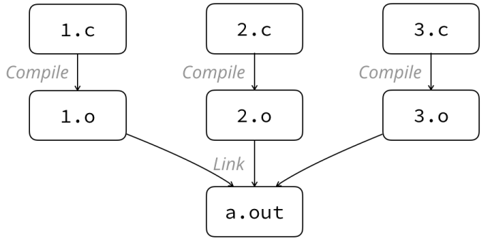

# Link's Adventures

Lyu Shiqing, School of Software | shiqing-thu18@yandex.com  
23 April 2019

---

## Overview

* Assumption: C language, UNIX, LLVM/Clang Toolchain
  - Transition to C++ and MSVC introduced at the end
* Why link at all
* What are symbols
* How to resolve linkage-related errors

## Why Link At All


We write code in order to build things that work. One cannot build the world
by themself; nor can a program.  In unity there is strength; this is true for
both humans and programs.

And linkage is here, for bringing different parts together, in order to create
an executable in the system.

> _It's dangerous to go alone! Take this!_

## Linkage & Compilation Modules

Compilation modules are single source files, or equivalently, single _object
files_. An object file is the compiled result of a source file, with extensions
`*.o` and `*.obj` under \*nix and Windows systems, respectively.

Linkage is performed after compilation in order to combine all object files into
an executable. It's done by a _linker_, usually invoked by the compiler
interface (e.g. `gcc` or `CL`).



## Symbols

_Symbols_ are names pointing to actual data.

_Global symbols_ are ones that are accessible by other modules, including:
* (Non-static) global variables & constants
* (Non-static) functions
* ~~× Type definitions (do not contain actual data)~~

Every object file contains a table of symbols for linkage so that other modules
can use (a.k.a. _reference_) them.

## Reference Resolution

Linkage is mostly done through _reference resolution_.

Let's take a look at how two simple objects are linked:

```c
/* foo.c */
int f();
int g();

int main()
{
    return f() + g();
}
```

```c
/* bar.c */
int f()
{
    return 1;
}

int g()
{
    return -2 + f();
}
```

After compilation, `foo.o` contains one symbol, `main`, which references `f` and
`g`. `bar.o` contains two symbols, `f` and `g`, without external references.
The contents of these symbols are addresses of the functions.

The linker reads the two objects, finds out the actual contents of each symbol,
and substitutes the placeholders in each object. This is the process of
reference resolution.

In this case, the addresses of `f` and `g` are written into the corresponding
locations of `foo.o` to form complete and correct machine instructions.

(Note: name mangling is disregarded here as it does not affect our explanations.)

## Eliminating Errors :smiling_imp:

### Duplicate Symbols

With this knowledge, we inspect a frequently-encountered issue in multi-file
projects. Let's take an example.

```c
/* foo.c */
int main()
{
    return 0;
}
```

```c
/* bar.c */
int main()
{
    return 1;
}
```

Run `gcc foo.c bar.c`, and the following error arises:

```plain
duplicate symbol _main in:
    /var/folders/kj/11cbmghs5hldrxtjknpqrk9h0000gn/T/foo-e8d12d.o
    /var/folders/kj/11cbmghs5hldrxtjknpqrk9h0000gn/T/bar-df9d6e.o
ld: 1 duplicate symbol for architecture x86_64
```

Now that we've understood the concept of symbols, the message is instantly
decipherable. We have two definitions of the symbol `_main` in two objects,
so it should be obvious how the issue can be resolved.

### Undefined Symbols

Here is another type of link errors:

```c
/* foo.c */
int f();
int g();

int main()
{
    return f() + g();
}
```

```c
/* bar.c */
int f()
{
    return 1;
}
```

Run `gcc foo.c bar.c`, and the following error arises:

```plain
Undefined symbols for architecture x86_64:
  "_g", referenced from:
      _main in foo-44666f.o
ld: symbol(s) not found for architecture x86_64
```

Undefined symbols are ones that do not have a definition (in this case
a function implementation). We need to provide one in any source file,
and the issue can be resolved.

Symbols are not restricted to functions, as can be seen in the following example
with global variables.

```c
/* foo.c */
extern int f;
extern int g;

int main()
{
    return f + g;
}
```

```c
/* bar.c */
int f = 1;
```

Error:

```plain
Undefined symbols for architecture x86_64:
  "_g", referenced from:
      _main in foo-829410.o
ld: symbol(s) not found for architecture x86_64
```

`extern` is analoguous to function declarations, and actual variable definitions
are analoguous to function implementations. With this mindset, we can deal with
the two cases in exactly the same way.

The examples are surely simple, but this knowledge will be of use in projects of
larger scales, because such issues are almost sure to appear in a project with
hundreds of files. Luckily, resolving them is often very straightforward as
we've already seen :)

## Name Mangling

_Name mangling_, a.k.a. _name decoration_, is a symbol-renaming mechanism in C++
compilers for distinguishing overloaded functions and symbols in different
classes or namespaces.

The mangled name usually combines the names (of namespaces, classes and symbols
themselves) and the types of arguments. In this way it's possible to distinguish
C++ symbols in the object file, which has no concept of overloading.

The GNU mangler does not consider return types as they do not affect overloading;
however, the MSVC mangler does put return types into the mangled name.

A few examples of mangled names in the GNU convention follow.

```cpp
Graph::MST *Graph::get_mst();
// __ZN5Graph7get_mstEv
// __Z = common prefix
// N = "start of nested name" marker
// 5 = length of "Graph"
// 7 = length of "get_mst"
// E = "end of nested name" marker
// v = void (argument)

int DisjointSetUnion::get_root(int u);
// __ZN16DisjointSetUnion8get_rootEi
// i = int (argument)

bool DisjointSetUnion::try_merge(int u, int v);
// __ZN16DisjointSetUnion9try_mergeEii
// i = int (argument 1)
// i = int (argument 2)

bool output();
// __Z6outputv

extern "C" void output();
// _output
```

Note that the mangling rule for plain C symbols accounts for the underscores
in previous examples, i.e. `_f`, `_g`, etc.

Examples for MSVC are as follows.

```cpp
int func1(char ch);
// ?func1@@YAHD@Z
// YA = function with __cdecl calling convention
// H = int (return type)
// D = char (argument 1)

int func2(int x, int y);
// ?func2@@YAHHH@Z
// H = int (return type)
// H = int (argument 1)
// H = int (argument 2)

void func3(klass obj);
// ?func3@@YAXVklass@@@Z
// X = void (return type)
// Vklass@@ = type name "klass" (argument 1)

void klass::func4(int x);
// ?func4@klass@@QAEXH@Z
// QAE = function with __thiscall calling convention

int klass::nested::func5(int x);
// ?func5@nested@klass@@QAEHH@Z

int var1;
// ?var1@@3HA
// H = int (type)
// A = global variable

const int klass::var2;
// ?var2@klass@@2HB
// H = int (type)
// B = constant
```

[This page](https://itanium-cxx-abi.github.io/cxx-abi/abi.html#mangling) has
detailed information on GNU mangling, and [this page](http://www.kegel.com/mangle.html)
for MSVC mangling. While mangling conventions strive to be readable to humans,
such references will be of help from time to time.

## Food For Thought

With the knowledge introduced so far, the following problems can be explained.

* Is `#include <stdio.h>` the only step towards using the standard library?
  What happens under the hood?
* What is the intent of `extern "C"` in some header files?

## Further Readings

* Relocation
* Strong & weak symbols
* Dynamic linking (`*.so, *.dll`)
* Calling conventions

## And Again...

_It's dangerous to go alone!_

With today's knowledge, you will be better prepared for large, cooperative
projects, and hopefully, build things that work in a united manner.


Happy linking! ^ ^
