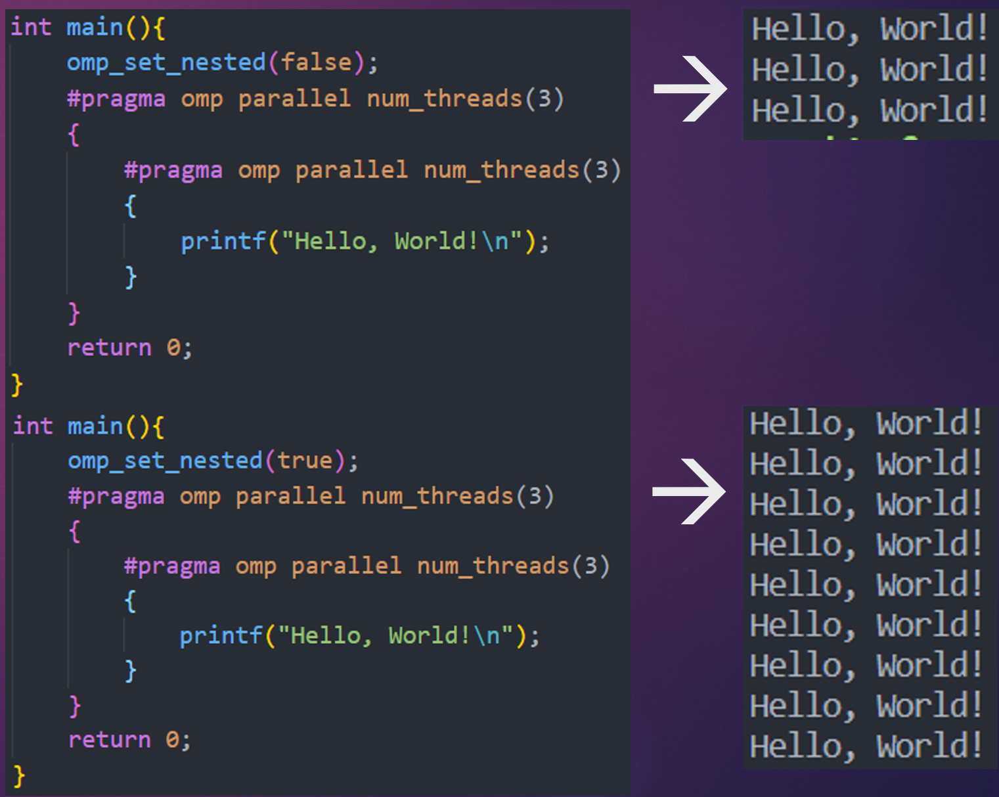
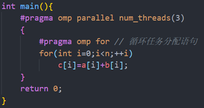
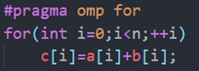
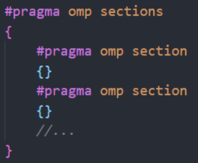
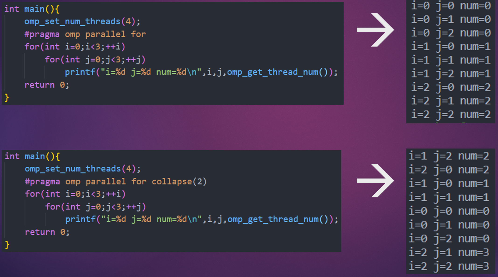

# OpenMP简单入门

#### 致理-信计01 袁兴业

## OpenMP概述

### [Open Multi-Processing](http://www.openmp.org/)

- 显式指导多线程、共享内存并行的API
  - 轻量级、可移植的语法标准
  - 增量式并行
  - 需要编译器支持（如C++）
    - 编译选项： `–fopenmp` 
    - `#include <omp.h>` 
- OpenMP <font color='red'>并非</font>
  - 自动并行化
  - 一定保证加速
  - 自动避免数据竞争

### OpenMP设计理念：<font color='red'>增量式并行</font>

- 先编写串行程序
- 后添加并行化指导语句
- 如同写了一句注释
- 

### OpenMP组成

#### 编译器预处理指导语句（~80%）

- 语法： `#pragma omp 指导语句名 子句1 子句2 ...` 
  - 指导语句名：`parallel, for, sections, single, ...` 
  - 子句：可写可不写，可以多个，用空格隔开（后续会介绍）
- 注：
  - 写错了编译器不给提示
  - 大小写区分
  - 指导语句作用于指导语句之后的语句块

#### 函数调用（~19%）

下面给出一些常用库函数：

```cpp
void omp_set_num_threads(int num_threads)//设置后续并行区的线程数
int omp_get_num_threads()//获取当前设置的线程数
int omp_get_thread_num()//获取当前线程的编号，主线程编号为 0
int omp_get_thread_limit()//获取程序可用的最大线程数
int omp_get_num_procs()//获取程序可用的处理器数量
int omp_in_parallel()//判断当前代码是否在并行区中
void omp_set_nested(bool nested)//设置后续并行区是否嵌套并行
int omp_get_nested()//判断后续并行区是否嵌套并行
```

#### 环境变量（~1%）

篇幅原因，自行了解

## 并行指导语句

### 并行区结构体

#### 基本语法

创建一组 OpenMP 线程以执行一个并行区：

```cpp
#pragma omp parallel 子句1 子句2 ...
{
    //并行区
}
```


- 程序运行至 parallel 时，创建一组线程
- 所有线程均执行并行区内的代码
- 并行区结束时，所有线程会同步（有一个隐式 barrier）
- 限制：
  - 并行区须为函数内的一个语句块
  - 不能跳转（`goto`）出入并行区
  - 并行区内可以调用其他函数

#### 设置线程数量

1.添加 `num_threads(int)` 子句

```cpp
#pragma omp parallel num_threads(4)
{
    //并行区
}
```

2.调用 `void omp_set_num_threads(int)` 函数

```cpp
omp_set_num_threads(4);
#pragma omp parallel
{
    //并行区
}
```

3.设置 `OMP_NUM_THREADS` 环境变量

运行程序时： `OMP_NUM_THREADS=4 ./openmp` 

#### 嵌套并行区

- 当禁用嵌套并行区时，内层并行区只用一个线程执行
- 启用/禁用嵌套并行区：
  - 调用 `void omp_set_nested(bool)` 
  - 设置 `OMP_NESTED` 环境变量
- 检查嵌套并行区是否开启：
  - 调用 `int omp_get_nested()` 



### 任务分配结构体

- 将代码区域中的任务自动分配给不同线程执行
- 例：
- 注：
  - **任务分配结构体必须包含在并行区内部**
  - 任务分配结构体不创建新线程
  - 进入任务分配结构体时，各线程<font color='red'>不同步</font>（没有隐式 `barrier` ）
  - 离开任务分配结构体时，各线程<font color='red'>同步</font>（有隐式 `barrier` ）

#### 基本语法

- 三种典型的任务分配结构体
  -  `DO/for` ：
    - 将循环的各次迭代分配给不同线程
    - C/C++中for循环，FORTRAN中DO循环
    - 例：
  -  `sections` ：
    - 将任务划分成若干个 `section` ，分配给不同线程
    - 每个 `section` 只被一个线程执行一次
    - 线程和 `section` 的对应关系是不确定的
    - 例：
  -  `single` ：
    - 仅使用并行区中的一个线程执行
    - 不执行此代码段的线程将等待此代码段执行结束（除非用了 nowait 子句）
    - 例：

#### 简便写法

- 以下两种写法是等价的：
- 对比：
  - 一个 `parallel` 内部的 `for` 会被每个线程执行一次
  - 然而当 `for` 之前加上了 `#pragma omp for` ，那么这个 `for` 会分配给一些线程，总的来看只运行一次

#### 嵌套循环

- 添加 `collapse` 子句， `collapse(n)` 表示紧随其后的 `n` 层循环会被合并然后并行化
- 如图，注意观察线程编号 `num` 的变化：
  - 上面只有 `3` 个，只有外层循环被并行化
  - 下面有 `4` 个，两层循环被合并然后并行化



## 数据共享与线程同步

限于篇幅原因，读者自行了解

## 参考文献

[OpenMP Tutorial](https://hpc.llnl.gov/openmp-tutorial)

